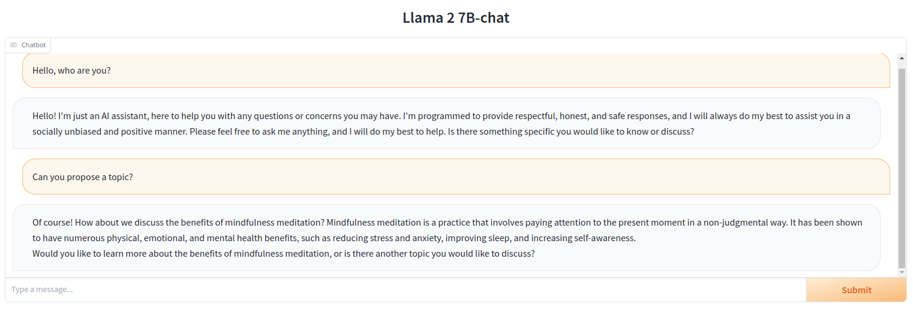

# Llama2-chat-interface




## Install Dependencies

```
python3 -m venv venv
source venv/bin/activate
pip install -r requirements.txt
```

## Download Weights

Go to https://ai.meta.com/llama/ to request access to the model weights and download them.

## Start Chat Interface

```
torchrun --nproc_per_node 1 chat.py --ckpt_dir llama-2-7b-chat/ --tokenizer_path tokenizer.model --max_seq_len 512 --max_batch_size 4
```

**Note:** Adapt `ckpt_dir` and `tokenizer_path` to point to the downloaded model.